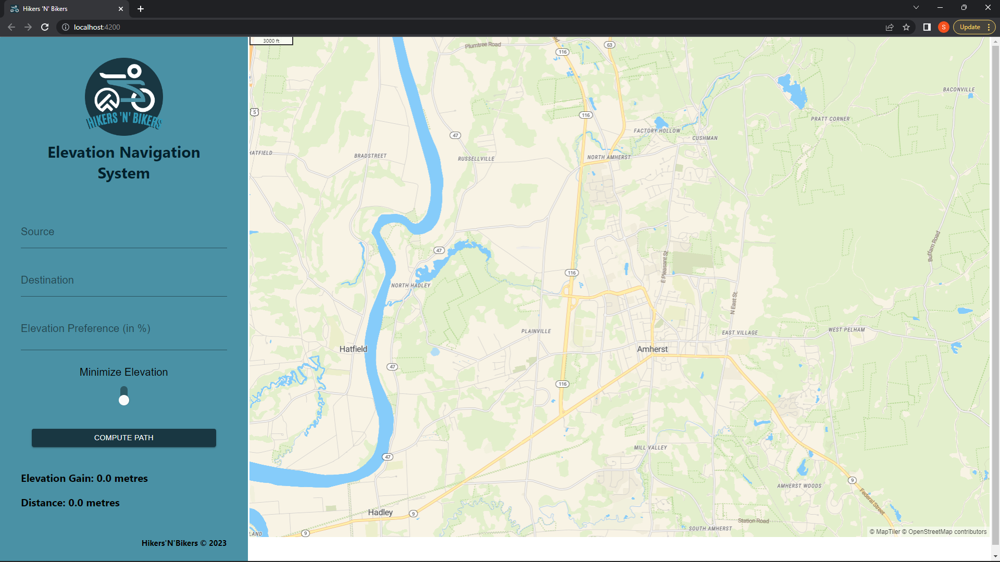
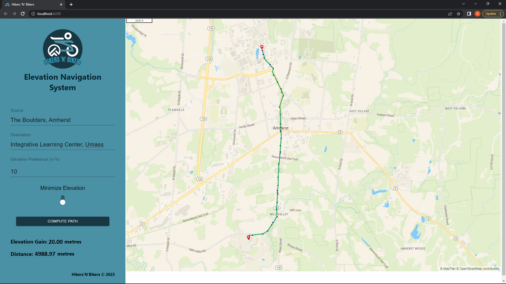
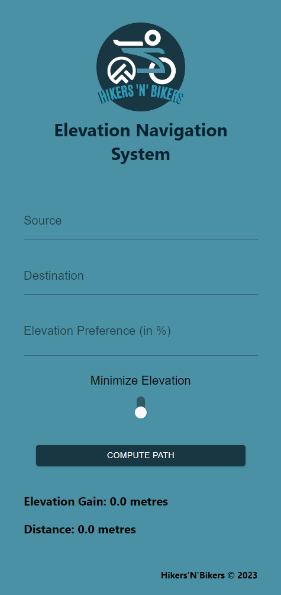

# Hikers N Bikers Elevation Navigation System
This elevation navigation system is developed by Hikers 'N' Bikers Pvt. Ltd. team:
<ul>
    <li> Swati Agrawal (swatagrawal264, swatiagrawal@umass.edu)
    <li> Medha Goel (goelmedha1, mgoel@umass.edu )
    <li> Aryan Singh (arysingh@umass.edu)
    <li> Pragadeeshwar Dakshinamurthi(pdakshinamur@umass.edu)
</ul>

This system queries from the user:
<ul>
    <li> Starting Address
    <li> Ending Address
    <li> Elevation Preference
    <li> Maximum or Minimum Elevation
    <li> Search Button
</ul>
It calculates the path based on the provided inputs.
The path is then plotted on the map in real time. 

# Setting up the environment
To set up the environment for running the application, follow these steps:

1. Create an .env file in the repository, parallel to the sample.env file.
2. Replace the placeholder values in the .env file with the appropriate API keys required for the application.

# Getting Started with Create React App

This project was initialized using [Create React App]https://create-react-app.dev/

## Available Scripts

In the project directory, you can use the following scripts:

### `npm install` 
This command installs all the necessary packages mentioned in the package.json file.

### `npm install --force`
If there is a version conflict between the local and global node versions, you can use this command to force installation. 

### `npm start`

Runs the application in development mode.
Open http://localhost:4200 in your browser to view the app.

The page will automatically reload whenever you make changes.
You can also check for any lint errors in the console.

### `npm test`

Launches the test runner in interactive watch mode.
For more information on running tests, refer to the running tests section.

### `npm run build`

Builds the app for production to the `build` folder.\
It correctly bundles React in production mode and optimizes the build for the best performance.

The build is minified and the filenames include the hashes.\
Your app is ready to be deployed!

See the section about [deployment](https://facebook.github.io/create-react-app/docs/deployment) for more information.

### `npm run eject`

Note: This is a one-way operation. Once you eject, you cannot revert back!

If you are not satisfied with the build tool and configuration choices provided by Create React App, you have the option to eject at any time. Ejecting will remove the single build dependency from your project.

Instead, it will copy all the configuration files and the dependencies (such as webpack, Babel, ESLint, etc.) directly into your project. This gives you complete control over the configurations and allows you to customize them according to your needs. All the commands except eject will still work, but they will point to the copied scripts, allowing you to modify them as required. From this point onwards, you will be responsible for maintaining and configuring the build process.

It's important to note that you are not obligated to use the eject feature. Create React App offers a curated feature set that is suitable for small and medium deployments. You can continue using the provided features without the need to eject. However, we understand that customization may be necessary for certain projects, and the eject feature allows you to do so when you are ready.

## Learn More

You can learn more in the [Create React App documentation](https://facebook.github.io/create-react-app/docs/getting-started).

To learn React, check out the [React documentation](https://reactjs.org/).

### Code Splitting

This section has moved here: [https://facebook.github.io/create-react-app/docs/code-splitting](https://facebook.github.io/create-react-app/docs/code-splitting)

### Analyzing the Bundle Size

This section has moved here: [https://facebook.github.io/create-react-app/docs/analyzing-the-bundle-size](https://facebook.github.io/create-react-app/docs/analyzing-the-bundle-size)

### Making a Progressive Web App

This section has moved here: [https://facebook.github.io/create-react-app/docs/making-a-progressive-web-app](https://facebook.github.io/create-react-app/docs/making-a-progressive-web-app)

### Advanced Configuration

This section has moved here: [https://facebook.github.io/create-react-app/docs/advanced-configuration](https://facebook.github.io/create-react-app/docs/advanced-configuration)

### Deployment

This section has moved here: [https://facebook.github.io/create-react-app/docs/deployment](https://facebook.github.io/create-react-app/docs/deployment)

### `npm run build` fails to minify

This section has moved here: [https://facebook.github.io/create-react-app/docs/troubleshooting#npm-run-build-fails-to-minify](https://facebook.github.io/create-react-app/docs/troubleshooting#npm-run-build-fails-to-minify)

 # User Interface 

# User Interface with sample path

# EleNa UI

